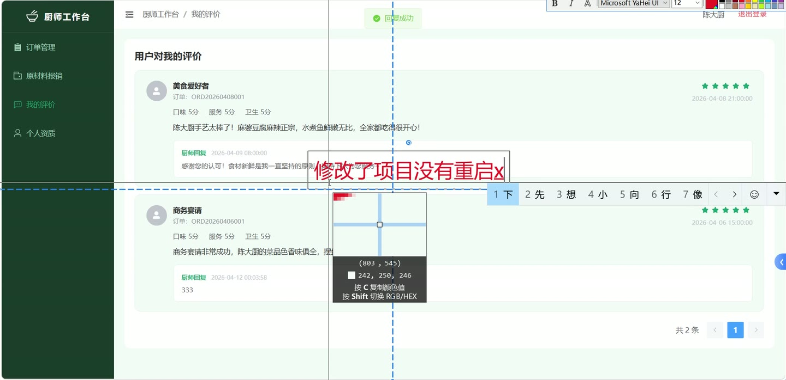
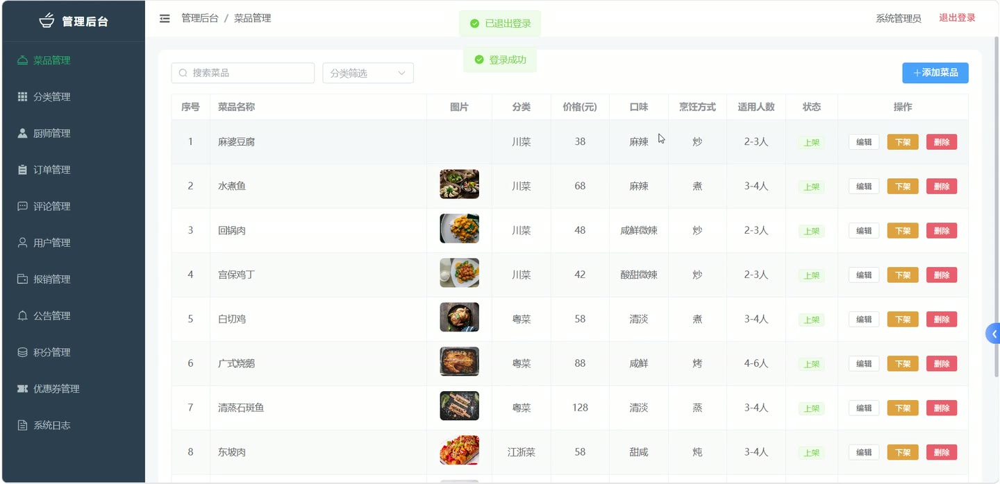
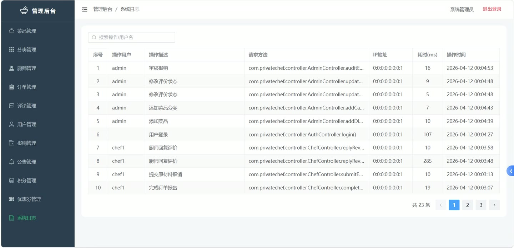
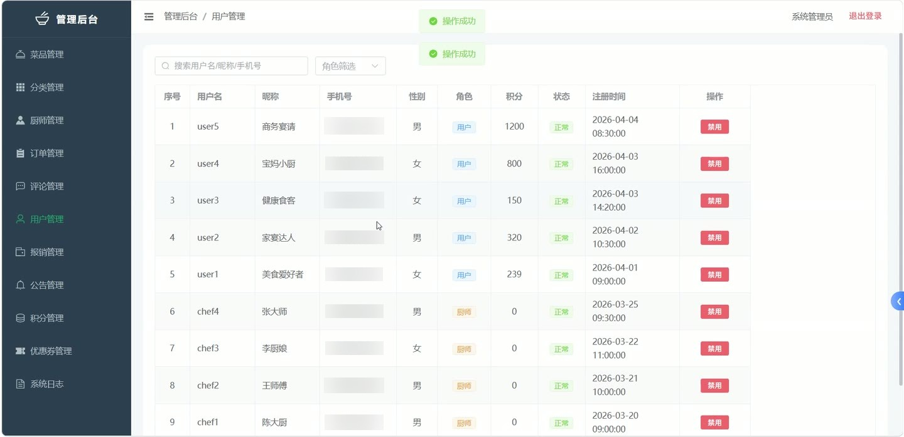

# (附文档)Springboot3+Vue3+MySQL 私厨上门服务管理系统

**技术栈**：Springboot3、Vue3、MySQL

### 系统简介

本系统是一套基于 SpringBoot3 + Vue3 + MySQL 构建的私厨上门服务管理平台，采用前后端分离架构，支持普通用户、厨师、管理员三种角色。用户可在线浏览菜品与厨师、预约上门服务、提交评价并使用优惠券；厨师可接单、管理服务流程及提交原材料报销；管理员负责用户管理、菜品分类与上下架、厨师资质审核、订单分配、报销审核、公告发布、积分规则及优惠券配置等全链路运营管理。
 
### 核心功能
 
### 普通用户端

 
- 浏览菜品分类列表（仅显示启用分类，按排序字段升序排列） 
- 查看上架菜品列表，支持按关键词、分类、口味、烹饪方式筛选 
- 查看菜品详情（名称、描述、价格、图片、分类名称等） 
- 浏览已认证厨师列表，支持按擅长领域、服务区域筛选 
- 查看厨师详情（真实姓名、资质证书、评分、接单数等） 
- 创建预约订单：选择厨师、填写服务地址/时间/菜品、选择优惠券，系统自动计算优惠金额与实付金额 
- 查看我的订单列表，支持按订单状态筛选（待服务/服务中/已完成/已取消） 
- 查看订单详情（订单编号、联系人、电话、地址、服务时间、厨师信息等） 
- 取消订单（需填写取消原因，仅允许在完成前取消） 
- 对已完成订单提交评价（评分+文字内容，自动更新厨师平均评分） 
- 查看我的评价列表（含用户昵称、厨师姓名、订单号、评价内容、回复内容） 
- 查看我的积分记录（积分变动明细、类型、描述、关联订单） 
- 领取优惠券（需在有效期内且剩余数量 > 0） 
- 积分兑换优惠券（扣除用户积分并自动领取） 
- 查看我的优惠券列表（按状态筛选：未使用/已使用/已过期） 
- 提交厨师入驻申请（填写真实姓名、身份证、擅长领域、经验年数、服务区域、资质证书等） 
- 查看已发布的公告列表（仅显示状态为已发布的公告） 
- 查看可领取的优惠券列表（已生效且未过期、剩余数量大于0） 
- 用户登录/注册/修改密码/更新个人信息
 
### 厨师端

 
- 查看本人厨师资质信息（真实姓名、身份证、资质证书、评分、接单数、审核状态等） 
- 更新厨师资质信息（修改后自动置为待审核状态，需管理员重新审核） 
- 查看分配给我的订单列表，支持按状态筛选 
- 接单（将待分配订单状态改为待服务） 
- 开始服务（将待服务订单状态改为服务中） 
- 完成订单并填写服务总结（将服务中订单改为已完成，同时自动发放积分给用户并增加厨师接单数） 
- 提交原材料报销申请（关联订单、填写费用明细） 
- 查看本人的报销记录列表（含订单编号、厨师姓名、审核状态） 
- 查看本人收到的评价列表（含用户昵称、评分、内容、回复状态） 
- 回复用户评价（填写回复内容，每条评价仅可回复一次）
 
### 管理员端

 
- 分页查询用户列表，支持按关键词（用户名/昵称/手机号）和角色筛选 
- 修改用户状态（启用/禁用） 
- 管理菜品分类：查看分类列表（按排序字段排序）、添加/编辑/删除分类 
- 分页查询菜品列表，支持按关键词、分类、状态筛选 
- 添加/编辑/删除菜品（名称、描述、价格、分类、口味、烹饪方式、图片等） 
- 菜品上下架（修改状态字段） 
- 分页查询厨师列表，支持按关键词（姓名/擅长/服务区域）和审核状态筛选 
- 审核厨师资质：通过（升级为 CHEF 角色）或拒绝（回退为 USER 角色），填写审核备注 
- 删除厨师资质信息 
- 分页查询所有订单，支持按关键词（订单号/联系人/电话）和订单状态筛选 
- 为订单分配厨师（将待分配订单改为待服务） 
- 分页查询评价列表，支持按关键词和显示状态筛选 
- 修改评价显示状态（显示/隐藏） 
- 删除评价 
- 分页查询报销列表，支持按审核状态筛选 
- 审核报销申请（通过/拒绝），填写审核备注 
- 分页查询公告列表，支持按关键词和类型筛选 
- 添加/编辑/删除公告（标题、内容、类型、发布状态） 
- 查看积分规则列表 
- 更新积分规则（如每元获取积分数） 
- 分页查询优惠券列表，支持按关键词和状态筛选 
- 添加/编辑/删除优惠券（名称、类型、优惠金额/折扣率、最低消费、积分成本、有效期、剩余数量等） 
- 分页查询系统操作日志，支持按关键词（操作内容/用户名）搜索
 
### 技术栈

 后端框架Spring Boot 3.x ORMMyBatis-Plus 权限JWT Token 鉴权（请求属性注入 userId） 前端框架Vue 3 状态管理Vuex / Pinia（由 Vue3 项目标准配置） 构建工具Vite 数据库MySQL
 
### 交付内容

 
- 后端完整源码 
- 前端完整源码 
- 数据库初始化脚本 
- 万字文档

## 界面展示

---

## 获取完整源码 + 万字文档

本仓库为项目介绍页。**完整前后端源码、数据库初始化脚本、万字项目文档**，请加微信 `kangkangcode`，或访问 [codekk.top](http://codekk.top) 获取。

可作课程设计 / 毕业设计参考，支持远程部署调试。